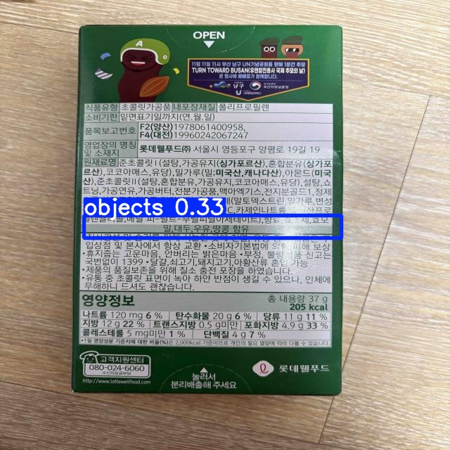

# GoodToSee - 사용자 맞춤형 알러지 정보 음성 안내 서비스

## 📌 프로젝트 개요
시각장애인을 위한 맞춤형 상품 정보 안내 서비스입니다.  
기존 어플리케이션의 한계를 보완하여, 상품 라벨 중 **알러지 유발 성분 정보만을 선별적으로 추출**하고, 이를 **음성으로 안내**하는 프로토타입을 개발했습니다.

---

## 🎯 주요 기능
- **YOLOv5 객체 인식**: 상품 라벨 중 알러지 정보 영역 검출
- **OCR (EasyOCR)**: 검출 영역에서 텍스트 인식
- **Tacotron2 기반 TTS**: 추출된 정보 음성 출력

---

## 🖼️ 데모 이미지

---

## 🧩 기술 스택
- Python, OpenCV
- YOLOv5 (Ultralytics)
- EasyOCR
- Tacotron 2 (TTS)
